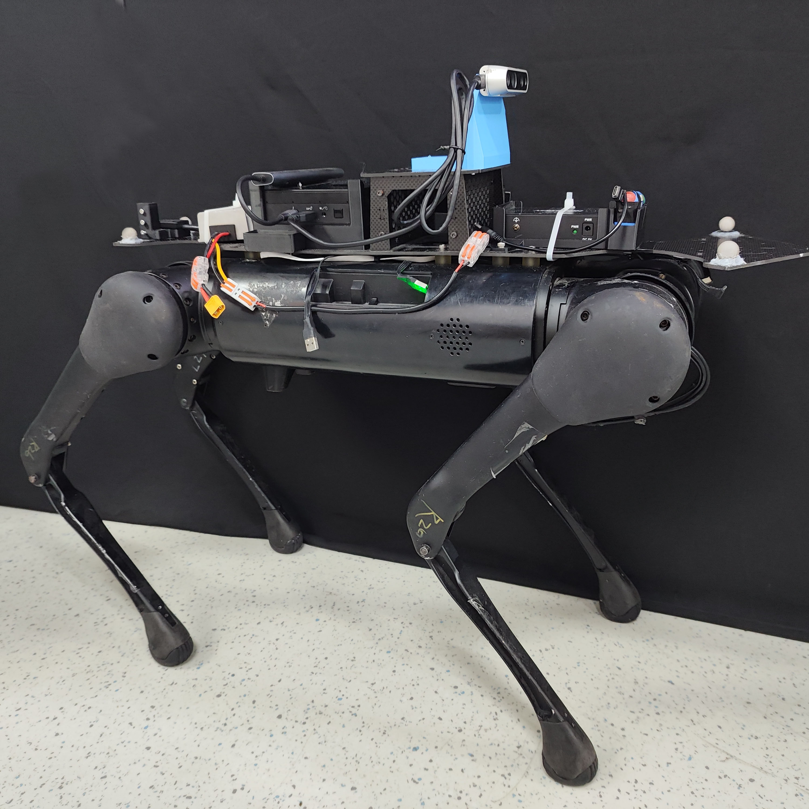
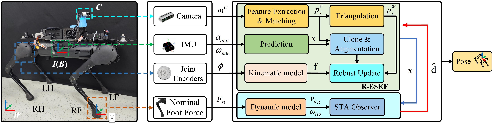
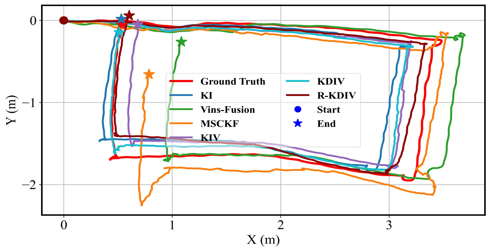
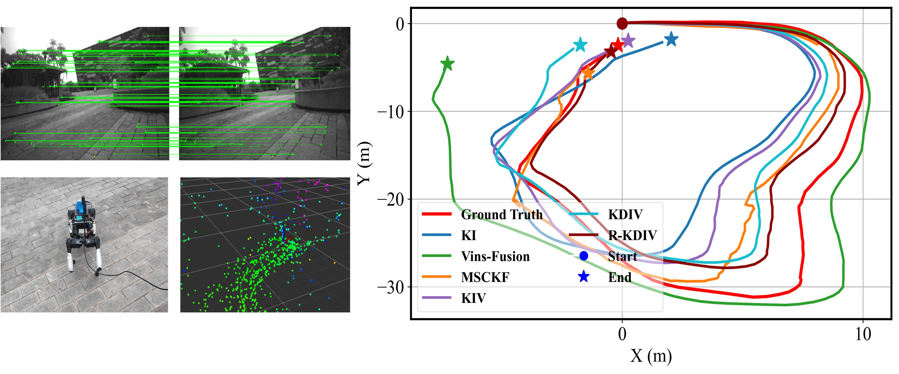

# R-KDIV

R-KDIVO is a robust kinematic-dynamic-inertial-visual odometry framework for legged robot pose estimation. The proposed framework integrates visual, inertial, encoder, and controller-derived foot-force information to improve state estimation robustness under challenging locomotion conditions. The core estimation module is built upon a Robust Error-State Kalman Filter (R-ESKF), which fuses camera observations, IMU measurements, and joint encoder-based kinematic information in a unified filtering framework. To account for the degradation of visual measurements caused by contact-induced vibration, motion blur, and challenging robot-ground interactions, an adaptive noise adjustment strategy is introduced based on the innovation error. To further enhance robustness against unmodeled contact effects, an STA-based disturbance observer is introduced. The observer uses the nominal foot-force inputs provided by the legged robot controller together with the robot dynamic model to estimate a lumped disturbance term. This estimated disturbance is then fed back into the ESKF propagation process to compensate for model errors, contact uncertainty, and external perturbations. The datasets and source code will be released in the future.
## Platform: AlienGo

  

## Framework

  
   
  <b>Fig. 1.</b> The proposed R-KDIV framework.

## Experimental Results

### Indoor sequence

  
   
  <b>Fig. 2.</b> Indoor trajectory comparison.

### Outdoor sequence

  
   
  <b>Fig. 3.</b> Outdoor Campus trajectory comparison.

### Challenge scene

  
   
  <b>Fig. 4.</b> Challenge scenes trajectory comparison, including foot slippage and camera occlusion.

